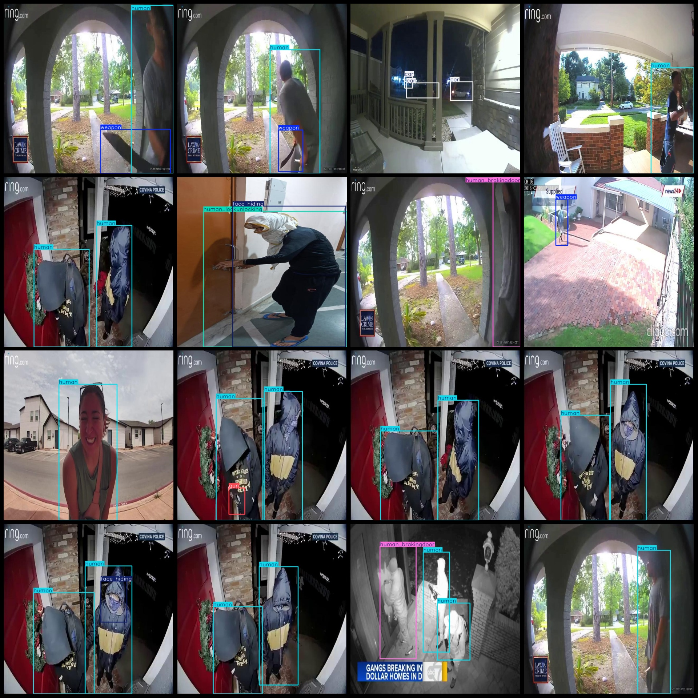
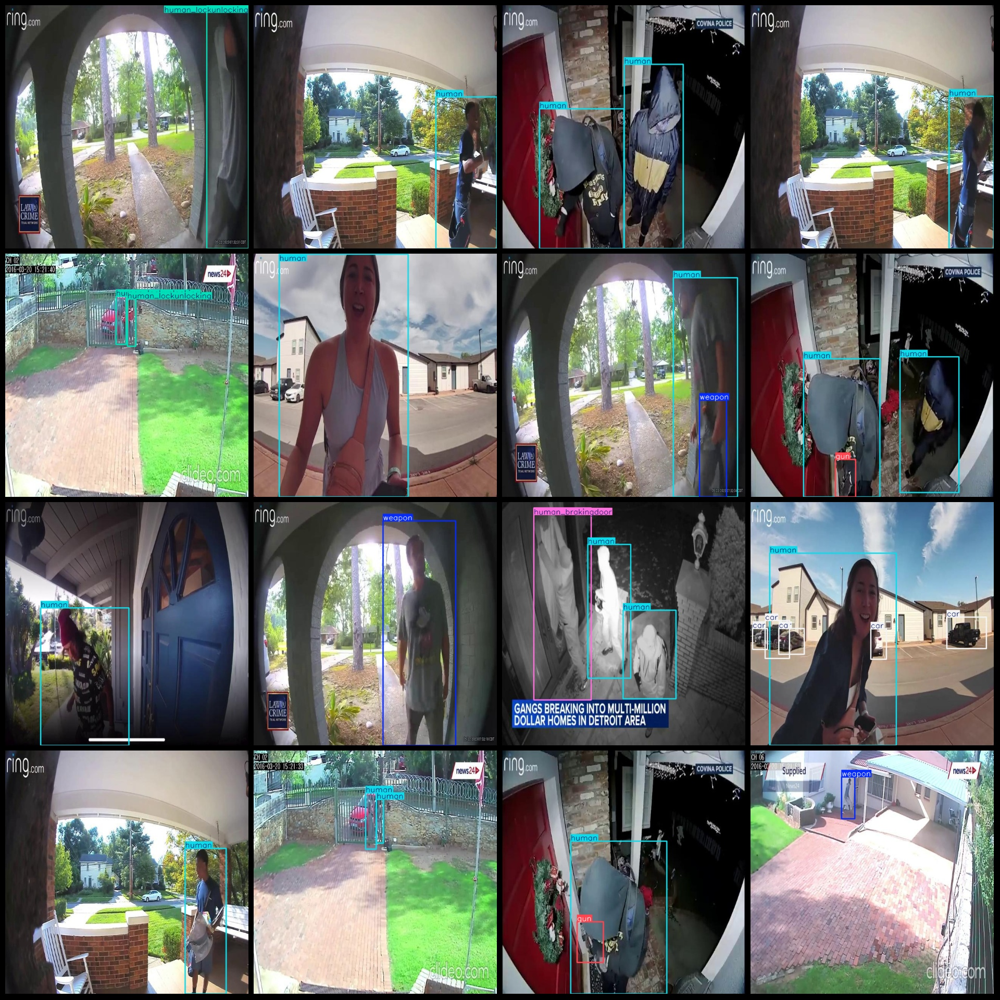

# External Viewpoint Surveillance of Abnormal Human Behavior in Doors dataset (VOC+YOLO format, 2277 images in 8 categories)

Dataset format: Pascal VOC format + YOLO format (txt files without split paths, only containing jpg images along with corresponding VOC format xml files and YOLO format txt files)
Number of images (jpg file count): 2277
Number of annotations (xml file count): 2277
Number of annotations (txt file count): 2277
Number of annotation categories: 8
Annotation category names (note that the order of categories in the YOLO format does not correspond to this, but is based on the "labels" folder's "classes.txt"): ["car", "face hiding", "gun", "human", "human in hurry", "human_brakingdoor", "human_lockunlocking", "weapon"]
Number of boxes per category:
- Car boxes = 205
- Face hiding boxes = 117
- Gun boxes = 104
- Human boxes = 2673
- Human in hurry boxes = 154
- Human_brakingdoor boxes = 265
- Human_lockunlocking boxes = 207
- Weapon boxes = 313
Total number of boxes: 4038
Image resolution: 640x640
Annotation tool used: labelImg
Annotation rules: Draw a box around the category
Important note: No guarantees are made regarding the accuracy of the trained model or the weights file.
Photo preview:
Annotation example:
## Images

Here is a pay link on Stripe ( https://buy.stripe.com/3cs8yP7sY87d0vu9AB ). Please contact me lonlonago@foxmail.com after funding $89, and I will send you a complete data files , thank you!

